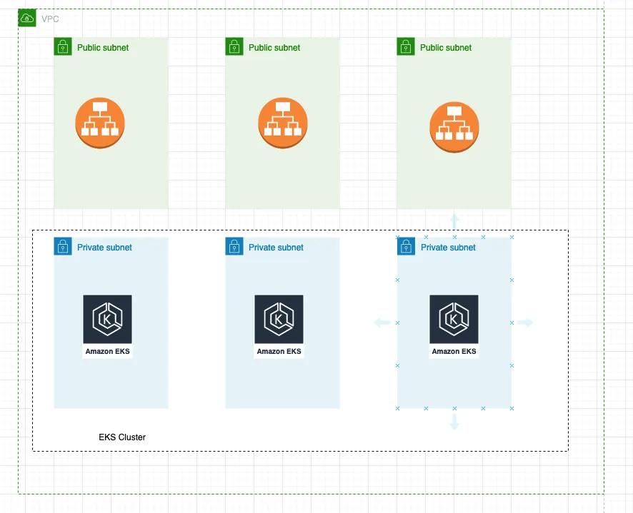

# CD Pipeline for Deploying Counter Service Application

This repository contains the CD pipeline configuration for deploying the counter-service application to an EKS cluster using Terraform and Kubernetes.

## Environment Setup

### Kubernetes

- **EKS Cluster**: The environment is set up with an EKS cluster deployed via an IaC pipeline using Terraform.
- **Region**: The EKS cluster is deployed in the `eu-west-1` region.
- **Remote State**: Terraform state is stored remotely in an S3 bucket.
- **Availability Zones**: The EKS cluster spans  3 Availability Zones.
- **Subnets**: There are 6 subnets configured - 3 private and 3 public.
- **Nodegroup**: The node group is deployed in private subnets, and the Load Balancer is deployed in the public subnets.

### CI/CD Pipeline

The CI/CD pipeline is configured to perform the following steps:

1. **Checkout**: Fetches the code from the repository.
2. **Configure AWS Credentials**: Sets up AWS credentials for accessing AWS resources.
3. **Initialize Terraform**: Initializes Terraform configuration.
4. **Validate Terraform Configuration**: Validates the Terraform files.
5. **Apply Terraform Configuration**: Applies the Terraform configuration to set up the EKS cluster.
6. **Deploy Application to Kubernetes**: Deploys the counter-service Docker image to the EKS cluster using Helm.
7. **Validation Step**: Validates Terraform and YAML files.
9. **Destroy Infrastructure**: Destroys the Terraform-managed infrastructure when the DESTORY var is true.

## Environment Variables and Secrets

### Secrets:
- **AWS_ACCESS_KEY_ID**: Your AWS access key ID.
- **AWS_SECRET_ACCESS_KEY**: Your AWS secret access key.
- **ECR_REGISTRY**: Your ECR registry URL.

### Variables:
- **AWS_REGION**: The AWS region where your ECR repository and EKS cluster are located.
- **CLUSTER_NAME**: The name of your EKS cluster.
- **NAMESPACE**: The Kubernetes namespace where the application will be deployed.
- **CD_GIT_REPO**: The name of your CD repo that will be triggered from this pipeline.
- **DESTROY**: A boolean variable (`true` or `false`) to determine whether to destroy the environment.

